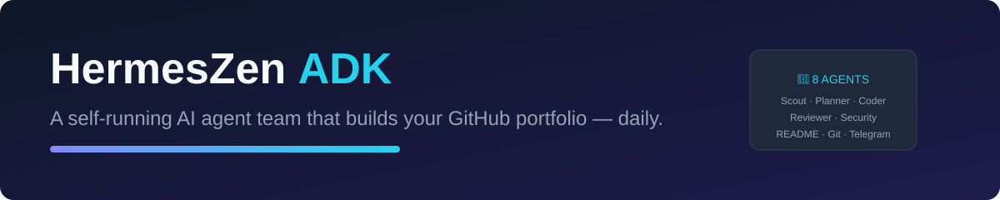

<p align="center">
  
</p>

# HermesZen ADK ☤

<p align="center">
  <a href="https://github.com/yousufkidiya17/hermeszen-adk"></a>
  <a href="https://github.com/google/adk-python"></a>
  <a href="https://opencode.ai/zen"></a>
  <a href="https://github.com/yousufkidiya17/hermeszen-adk/blob/main/LICENSE"></a>
  <a href="https://cloud.google.com/free"></a>
  <a href="https://www.python.org/"></a>
  <a href="https://nodejs.org/"></a>
</p>

<p align="center"><b>A self-running AI developer team that builds your GitHub portfolio — every single day.</b></p>
<p align="center">8 specialist agents · Google ADK · DeepSeek (free) · Telegram control · 100% free infra</p>

---

## ✨ What is this?

**HermesZen ADK** is a complete multi-agent system that works like a real software team:

| Agent | Job |
|---|---|
| 🕵️ **Scout** | Finds trending repos & good-first-issues |
| 👨‍💼 **Planner** | Picks today's best task |
| 👨‍💻 **Coder** | Writes code & contributions |
| 🧪 **Reviewer** | Quality gate — max 2 retries |
| 🛡️ **Security** | Secret & dependency audit |
| 📝 **README** | Professional docs with badges |
| 🚀 **Git** | Commit, push, PR |
| 📱 **Telegram** | Step-by-step updates to your phone |

You talk to it on **Telegram** — it suggests tasks, you pick one, and the team executes end-to-end: plan → code → review → security → docs → commit → PR → report.

## 🏗️ Architecture

```
📱 TELEGRAM (your control center)
      │
      ▼
🤖 HERMES ORCHESTRATOR
      │
      ▼
🧩 ADK AGENT TEAM (8 specialists)
      │
      ▼
🌉 BRIDGE — OpenCode Zen proxy (fixed session, rate-limit safe)
      │
      ▼
⚡ DeepSeek V4 Flash + MiMo vision — 100% FREE
```

Every AI call flows through the local bridge (127.0.0.1:4000) — the same battle-tested fixed-session setup that keeps free OpenCode Zen models stable.

## 📅 Weekly Task Rotation

| Day | Task | Example |
|---|---|---|
| Mon | New project | weather-cli, todo-api, quiz-game |
| Tue | Open-source contribution | good-first-issue PR |
| Wed | Medium project | scraper, csv analyzer |
| Thu | README upgrade (PR) | professional docs for a repo |
| Fri | Security check + fix | secret scan + dependency audit |
| Sat | Showcase project | dashboard, bot, tool |
| Sun | Rest / backlog | catch up, polish |

**One month = 20+ real, diverse contributions** — projects, PRs, security reports, READMEs. A portfolio that writes itself while you learn.

## 🚀 Quick Start

### Prerequisites

- Python 3.10+, Node.js 18+
- Any Linux VM (GCP free tier e2-micro works great) — or your PC
- Telegram bot token (from [@BotFather](https://t.me/BotFather))
- GitHub repo with a deploy key

### Install

```bash
# 1. Clone
git clone git@github.com:yousufkidiya17/hermeszen-adk.git
cd hermeszen-adk

# 2. Bridge (LLM gateway → OpenCode Zen free models)
cd bridge
npm install
node server.mjs &

# 3. ADK agents
cd ..
pip install google-adk "litellm>=1.84"

# 4. Verify bridge → DeepSeek
curl http://127.0.0.1:4000/v1/models

# 5. Run the team
python3 workflow.py
```

### One-liner test

```bash
python3 agents/planner.py --test   # picks a task
python3 agents/coder.py --test     # writes code
```

## 📁 Project Structure

```
hermeszen-adk/
├── bridge/
│   ├── server.mjs        # fixed-session bridge (DeepSeek via Zen)
│   └── package.json
├── agents/
│   ├── scout.py          # trending repos / issues
│   ├── planner.py        # task selection
│   ├── coder.py          # code + contributions
│   ├── reviewer.py       # quality gate
│   ├── security.py       # secret & dependency audit
│   ├── readme.py         # professional READMEs
│   ├── git.py            # commit / push / PR
│   └── telegram.py       # daily reports
├── workflow.py           # ADK graph (8 agents)
├── tools/
│   ├── github_tool.py    # repo / issue / PR helpers
│   └── security_tool.py  # scan helpers
├── idea_pool.md          # 100+ project ideas
├── config.yaml           # LiteLLM bridge config
├── run_daily.sh          # cron entry point
├── work/                 # daily output (committed)
└── README.md
```

## 🛠 Tech Stack

| Layer | Technology |
|---|---|
| Agent framework | **Google ADK 2.7** (LiteLLM connector) |
| LLM | **DeepSeek V4 Flash** (free) + **MiMo V2.5** vision (free) |
| Model gateway | OpenCode Zen via local bridge — fixed session, UA spoof |
| Orchestration | Hermes Agent (Telegram + workflow control) |
| Cloud | GCP free tier (e2-micro, 100GB disk) |
| Version control | GitHub via deploy key (SSH) |
| Notifications | Telegram Bot API |

## 🔒 Security

- 🛡️ Dedicated Security Agent — secrets, unsafe patterns, vulnerable deps
- 🔑 GitHub via repo-scoped deploy key (no broad access)
- 🌉 Bridge binds to localhost only
- ✅ Reviewer gate before every commit

## 🤝 Contributing

This repo is itself built by AI agents. Open an issue, suggest a task, or fork it for your own portfolio:

1. Fork the repository
2. Create your feature branch
3. Commit your changes
4. Push and open a Pull Request

## 📄 License

MIT — see [LICENSE](LICENSE).

---

<p align="center">
  <a href="https://github.com/yousufkidiya17"></a>
  <a href="https://github.com/yousufkidiya17/hermeszen-adk/stargazers"></a>
  <a href="https://github.com/yousufkidiya17/hermeszen-adk/forks"></a>
</p>

<p align="center"><i>Built by Yousuf Kidiya 🤍 with Hermes Agent + Google ADK</i></p>